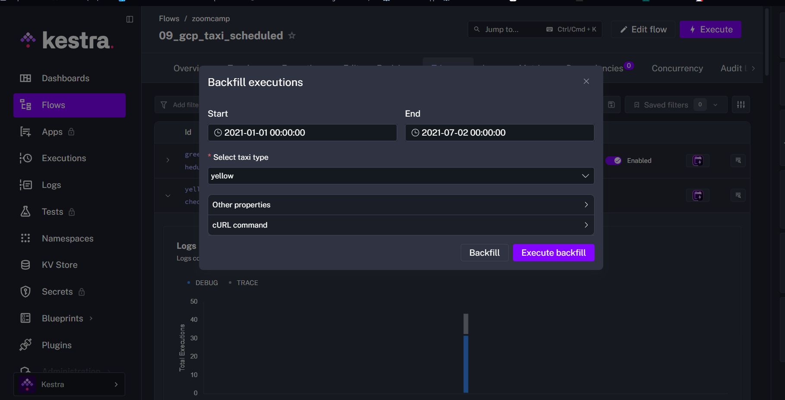

# Doing backfill of 2021 data from January to July



# 1.Within the execution for Yellow Taxi data for the year 2020 and month 12: what is the uncompressed file size (i.e. the output file yellow_tripdata_2020-12.csv of the extract task)?

- 128.3 MiB
- **134.5 MiB**
- 364.7 MiB
- 692.6 MiB

## Answer

`135.5 MiB`

# 2. What is the rendered value of the variable file when the inputs taxi is set to green, year is set to 2020, and month is set to 04 during execution?

- {{inputs.taxi}}_tripdata_{{inputs.year}}-{{inputs.month}}.csv
- **green_tripdata_2020-04.csv**
- green_tripdata_04_2020.csv
- green_tripdata_2020.csv

## Answer

`green_tripdata_2020-04.csv`

# 3. How many rows are there for the Yellow Taxi data for all CSV files in the year 2020?

- 13,537.299
- **24,648,499**
- 18,324,219
- 29,430,127

## Answer

- First we process the info backfilling
- Then we executed the following sql code into google coud yellow taxi table

```sql
SELECT COUNT(*) FROM `zoomcamp-489722 demo_taxi_zoomcamp.yellow_tripdata` WHERE tpep_pickup_datetime > "2019-12-31" AND tpep_pickup_datetime < "2021-01-01"
```

Result: `24,648,499`

# 4. How many rows are there for the Green Taxi data for all CSV files in the year 2020?

- 5,327,301
- 936,199
- **1,734,051**
- 1,342,034

## Answer

- First we process the info backfilling
- Then we executed the following sql code into google coud green taxi table

```sql
SELECT COUNT(*) FROM `zoomcamp-489722.demo_taxi_zoomcamp.green_tripdata` WHERE lpep_pickup_datetime > "2019-12-31" AND lpep_pickup_datetime < "2021-01-01"
```

Result: `1734051`

# 5. How many rows are there for the Yellow Taxi data for the March 2021 CSV file?

- 1,428,092
- 706,911
- **1,925,152**
- 2,561,031

## Answer

Run flow 08 with mont 3 and year 2021 on yellow taxi data, then get into details in google cloud

Result : `1952152`

## 6. How would you configure the timezone to New York in a Schedule trigger?

- Add a timezone property set to EST in the Schedule trigger configuration
- **Add a timezone property set to America/New_York in the Schedule trigger configuration**
- Add a timezone property set to UTC-5 in the Schedule trigger configuration
- Add a location property set to New_York in the Schedule trigger configuration

# Answer
Kestra requires IANA timezone names